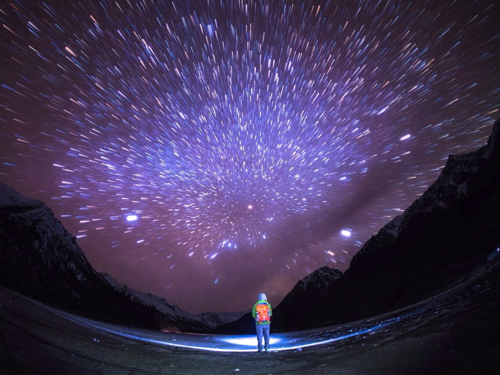

#   开智之旅
--- 
  我是一个愚钝之人，后知后觉。我还无趣，若硬生生的说有什么兴趣爱好，可能是阅读吧。然而书越读越没有了方向，看得懂，做不到，是谓知易行难。如上图，阅读之美仿佛满天璀璨繁星，自我探索有如黑夜里的脚下之路，远方还有崇山峻岭。心中点一盏灯，前行。

对了，我记性也不大好，只能改编某人的话为己用了：生命有两个时刻需要感谢，出生时和当下。许久以来，心中苦于寻找方向，屡屡失败。现在，第一次有机会和一群智慧的人在一起，

